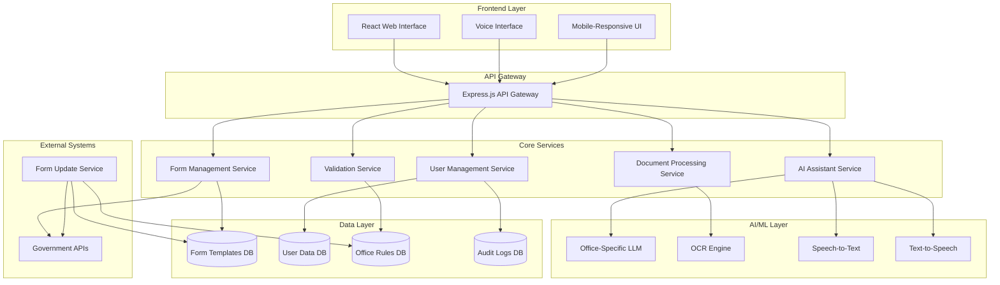

# Design Document: SevaSetu

## Overview

SevaSetu is a web-based AI system that helps citizens complete government forms correctly before submission. The system combines office-specific AI guidance, document validation, multilingual support, and human escalation to reduce form rejections and bureaucratic delays.

The architecture follows a layered approach with a React-based frontend, Node.js/Express backend, and specialized AI services for document processing and form validation. The system integrates with government databases for real-time form updates and maintains strict security standards for handling sensitive citizen data.

## Architecture

The system uses a microservices architecture with the following high-level components:



## Components and Interfaces

### Frontend Components

**Web Interface (React)**
- `FormWizard`: Main component orchestrating the form completion process
- `DocumentUploader`: Handles file uploads with drag-and-drop and camera capture
- `VoiceInterface`: Manages speech input/output with multilingual support
- `FormPreview`: Displays auto-filled forms for user confirmation
- `ProgressTracker`: Shows completion status and next steps
- `LanguageSelector`: Allows users to choose their preferred language

**Key Frontend Interfaces:**
```typescript
interface FormSession {
  sessionId: string;
  userId: string;
  officeType: string;
  formType: string;
  language: string;
  currentStep: number;
  documents: UploadedDocument[];
  formData: FormFieldData[];
  status: 'in-progress' | 'ready' | 'escalated';
}

interface UploadedDocument {
  id: string;
  filename: string;
  type: DocumentType;
  extractedText: string;
  validationStatus: ValidationResult;
  confidence: number;
}
```

### Backend Services

**Form Management Service**
- Manages form templates and versions
- Handles form auto-filling and generation
- Integrates with government APIs for updates
- Provides form validation against office rules

**AI Assistant Service**
- Orchestrates office-specific LLM interactions
- Manages conversation context and history
- Handles confidence scoring and escalation decisions
- Provides multilingual response generation

**Document Processing Service**
- OCR processing for uploaded documents
- Text extraction and data parsing
- Document type classification
- Validation against required document lists

**Validation Service**
- Rule-based validation engine
- Cross-field validation and consistency checks
- Missing document detection
- Rejection risk assessment

### AI/ML Components

**Office-Specific LLM**
- Fine-tuned language models per government office
- Continuously updated with latest procedures
- Multilingual support for regional languages
- Confidence scoring for response quality

**OCR Engine**
- Handles both printed and handwritten text
- Supports multiple document formats
- Extracts structured data from forms
- Validates document authenticity markers

**Speech Processing**
- Speech-to-text for multiple regional languages
- Text-to-speech with natural pronunciation
- Voice activity detection
- Audio quality enhancement

## Data Models

### Core Data Structures

**User Profile**
```typescript
interface UserProfile {
  userId: string;
  preferredLanguage: string;
  accessibilityNeeds: AccessibilityOptions;
  sessionHistory: FormSession[];
  createdAt: Date;
  lastAccessed: Date;
}
```

**Form Template**
```typescript
interface FormTemplate {
  templateId: string;
  officeId: string;
  formName: string;
  version: string;
  fields: FormField[];
  requiredDocuments: DocumentRequirement[];
  validationRules: ValidationRule[];
  lastUpdated: Date;
  isActive: boolean;
}

interface FormField {
  fieldId: string;
  fieldName: string;
  fieldType: 'text' | 'number' | 'date' | 'select' | 'checkbox';
  isRequired: boolean;
  validationPattern?: string;
  autoFillSource?: string;
  confirmationRequired: boolean;
}
```

**Office Configuration**
```typescript
interface OfficeConfig {
  officeId: string;
  officeName: string;
  supportedLanguages: string[];
  processingRules: ProcessingRule[];
  escalationThreshold: number;
  contactInfo: ContactInformation;
  operatingHours: OperatingHours;
}
```

**Validation Result**
```typescript
interface ValidationResult {
  isValid: boolean;
  confidence: number;
  issues: ValidationIssue[];
  suggestions: string[];
  riskLevel: 'low' | 'medium' | 'high';
}

interface ValidationIssue {
  issueType: 'missing_field' | 'format_error' | 'date_expired' | 'name_mismatch';
  fieldName: string;
  description: string;
  severity: 'error' | 'warning';
  suggestedFix?: string;
}
```

**Assistance Receipt**
```typescript
interface AssistanceReceipt {
  receiptId: string;
  sessionId: string;
  userId: string;
  officeId: string;
  formType: string;
  escalationReason: string;
  userProgress: FormSession;
  generatedAt: Date;
  assignedOfficer?: string;
  status: 'pending' | 'in-review' | 'resolved';
}
```

### Database Schema Design

**Form Templates Collection**
- Stores official government forms with versioning
- Indexed by office ID and form type for fast retrieval
- Includes validation rules and required document specifications

**User Sessions Collection**
- Maintains active and completed form sessions
- Stores uploaded documents and extracted data
- Tracks user progress and interaction history

**Office Rules Collection**
- Contains office-specific processing rules and procedures
- Updated automatically from government APIs
- Versioned to track rule changes over time

**Audit Logs Collection**
- Records all user interactions and system decisions
- Maintains compliance with government audit requirements
- Includes data access logs and processing timestamps

## Correctness Properties

*A property is a characteristic or behavior that should hold true across all valid executions of a system—essentially, a formal statement about what the system should do. Properties serve as the bridge between human-readable specifications and machine-verifiable correctness guarantees.*

Based on the requirements analysis, the following properties ensure the system behaves correctly across all valid inputs and scenarios:

### Property 1: Office-Specific Guidance Consistency
*For any* government service and office combination, the AI_Assistant should provide guidance that contains office-specific information and excludes information from other offices.
**Validates: Requirements 1.1**

### Property 2: System-Wide Language Consistency  
*For any* user language selection, all system interactions (text, voice, explanations, forms) should consistently use the selected language throughout the session.
**Validates: Requirements 1.3, 7.1**

### Property 3: Knowledge Base Completeness
*For any* office and form type combination, the AI_Assistant's knowledge base should contain current form versions, required documents, and common rejection reasons.
**Validates: Requirements 1.4**

### Property 4: Current Information Reference
*For any* guidance provided by the AI_Assistant, it should reference the most recent version of office procedures and requirements, not outdated information.
**Validates: Requirements 1.5**

### Property 5: Explanation Completeness
*For any* form process initiation, the system should provide explanations that include both the form's purpose and overall procedure.
**Validates: Requirements 2.1**

### Property 6: Interface Option Availability
*For any* system explanation or interaction, both voice and text options should be available to the user.
**Validates: Requirements 2.2**

### Property 7: Step-by-Step Clarification
*For any* user clarification request, the AI_Assistant should structure responses as simple, sequential steps rather than complex paragraphs.
**Validates: Requirements 2.3**

### Property 8: Audio Explanation Availability
*For any* system content, audio explanations should be available to support users with varying literacy levels.
**Validates: Requirements 2.4**

### Property 9: Language Simplicity
*For any* system instruction, the text should use non-technical language appropriate for first-time users, avoiding jargon and complex terminology.
**Validates: Requirements 2.5**

### Property 10: File Format Acceptance
*For any* document upload, the system should accept both scanned and photographed formats without rejection based on format type.
**Validates: Requirements 3.1**

### Property 11: OCR Text Extraction
*For any* uploaded document containing both printed and handwritten text, the system should extract text from both types of content.
**Validates: Requirements 3.2**

### Property 12: Comprehensive Document Validation
*For any* document set validation, the system should detect missing required documents, format issues, expired dates, name/address mismatches, and provide specific correction guidance for any issues found.
**Validates: Requirements 3.3, 3.4, 3.5**

### Property 13: Authenticity Validation
*For any* document with detectable authenticity markers, the system should perform appropriate validation checks where technically feasible.
**Validates: Requirements 3.6**

### Property 14: Auto-Fill Data Accuracy
*For any* validated document set, the extracted data should correctly populate the corresponding form fields without data corruption or misplacement.
**Validates: Requirements 4.1**

### Property 15: Template Compliance
*For any* form generation or auto-filling operation, only office-approved templates should be used, and all generated forms should match official formatting requirements.
**Validates: Requirements 4.2, 6.5**

### Property 16: Critical Field Confirmation Workflow
*For any* form with critical fields (name, address, purpose), the system should request explicit user confirmation, highlight these specific fields, and finalize data only after confirmation is received.
**Validates: Requirements 4.3, 4.4, 4.5**

### Property 17: Auto-Fill Transparency
*For any* auto-filled form data, all populated information should be visible to the user before finalization to prevent silent errors.
**Validates: Requirements 4.6**

### Property 18: Confidence-Based Escalation
*For any* AI_Assistant interaction with a confidence score below the threshold, an Assistance_Receipt should be generated automatically.
**Validates: Requirements 5.1**

### Property 19: Assistance Receipt Completeness
*For any* generated Assistance_Receipt, it should include applicant details, form type, submitted documents, and the exact confusion point or issue that triggered escalation.
**Validates: Requirements 5.2, 5.3**

### Property 20: Data Preservation During Escalation
*For any* escalation to human assistance, all user progress, uploaded documents, and session data should be preserved and accessible for continuation.
**Validates: Requirements 5.4, 9.6**

### Property 21: Receipt Distribution
*For any* Assistance_Receipt generation, the receipt should be provided to both the user and the concerned officer.
**Validates: Requirements 5.5**

### Property 22: Workflow Resumption
*For any* completed human assistance, the system should allow users to continue from the exact escalation point without data loss or restart.
**Validates: Requirements 5.6**

### Property 23: Comprehensive Output Generation
*For any* successful form completion, the system should generate a printable form template, downloadable version, comprehensive attachment checklist, and clear next-step instructions.
**Validates: Requirements 6.1, 6.2, 6.3, 6.4**

### Property 24: Submission Information Provision
*For any* ready form, the system should provide accurate submission location and timing information.
**Validates: Requirements 6.6**

### Property 25: Speech Processing Capability
*For any* voice input in supported regional languages, the system should accurately convert speech to text.
**Validates: Requirements 7.2**

### Property 26: Multilingual Form Accuracy
*For any* form data, the information should remain consistent and accurate across different language explanations and interfaces.
**Validates: Requirements 7.4**

### Property 27: Accessibility Feature Availability
*For any* user with visual or hearing impairments, appropriate accessibility features should be available and functional.
**Validates: Requirements 7.6**

### Property 28: Data Encryption
*For any* user document upload or data storage, encryption should be applied both in transit and at rest.
**Validates: Requirements 8.1**

### Property 29: Data Retention Policy Communication
*For any* completed processing, clear data retention and deletion policies should be presented to the user.
**Validates: Requirements 8.3**

### Property 30: Access Control
*For any* user data access attempt, the system should verify authorization and prevent sharing with unauthorized parties.
**Validates: Requirements 8.4**

### Property 31: Data Deletion Compliance
*For any* user data deletion request, the information should be permanently removed within the specified timeframe.
**Validates: Requirements 8.5**

### Property 32: Audit Log Completeness
*For any* data access or processing activity, appropriate audit logs should be created and maintained.
**Validates: Requirements 8.6**

### Property 33: Response Time Performance
*For any* standard system operation, the response time should be within 3 seconds.
**Validates: Requirements 9.1**

### Property 34: File Size Handling
*For any* document upload up to 10MB, the system should process the file without failure.
**Validates: Requirements 9.2**

### Property 35: Error Handling and Recovery
*For any* system error condition, clear error messages and recovery options should be provided to the user.
**Validates: Requirements 9.5**

### Property 36: Rule Engine Synchronization
*For any* office procedure change, the Rule_Engine should be updated to reflect the new procedures.
**Validates: Requirements 10.2, 10.5**

### Property 37: User Notification for Updates
*For any* system update affecting in-progress applications, affected users should receive notifications about the changes.
**Validates: Requirements 10.3**

### Property 38: Version Control Maintenance
*For any* form or procedure in the system, proper version tracking should be maintained.
**Validates: Requirements 10.4**

### Property 39: Administrator Preview Tools
*For any* system change, administrators should have access to functional preview tools before deployment.
**Validates: Requirements 10.6**

## Error Handling

The system implements comprehensive error handling across all layers:

### Input Validation Errors
- **Invalid file formats**: Graceful rejection with format guidance
- **Oversized uploads**: Clear size limit messaging with compression suggestions
- **Corrupted documents**: OCR failure handling with re-upload prompts
- **Missing required fields**: Specific field identification and completion guidance

### Processing Errors
- **OCR extraction failures**: Fallback to manual entry with guided assistance
- **AI confidence threshold failures**: Automatic escalation to human assistance
- **Form template mismatches**: Version validation and update prompts
- **Network connectivity issues**: Offline mode with progress preservation

### System Errors
- **Database connectivity failures**: Graceful degradation with cached data
- **External API failures**: Fallback procedures and user notification
- **Authentication errors**: Clear re-authentication flows
- **Session timeouts**: Progress preservation and seamless restoration

### Recovery Mechanisms
- **Automatic session restoration**: Progress recovery after interruptions
- **Data backup and rollback**: Point-in-time recovery for critical operations
- **Graceful degradation**: Core functionality maintenance during partial failures
- **User-friendly error messages**: Clear explanations with actionable next steps

## Testing Strategy

The testing approach combines unit testing for specific scenarios with property-based testing for comprehensive coverage:

### Unit Testing Approach
Unit tests focus on specific examples, edge cases, and integration points:
- **Document processing edge cases**: Empty files, corrupted data, unusual formats
- **Form validation scenarios**: Specific field combinations and validation rules
- **User interface interactions**: Button clicks, form submissions, navigation flows
- **Error condition handling**: Network failures, timeout scenarios, invalid inputs
- **Integration points**: API calls, database operations, external service interactions

### Property-Based Testing Configuration
Property-based tests verify universal properties across all inputs using **fast-check** (JavaScript/TypeScript):
- **Minimum 100 iterations** per property test to ensure comprehensive input coverage
- **Custom generators** for government forms, documents, and user data
- **Shrinking capabilities** to find minimal failing examples
- **Confidence score validation** across random input combinations
- **Cross-language consistency** testing with generated multilingual content

Each property-based test references its corresponding design property:
```javascript
// Example test structure
test('Property 1: Office-Specific Guidance Consistency', () => {
  fc.assert(fc.property(
    officeServiceGenerator(),
    (officeService) => {
      const guidance = aiAssistant.getGuidance(officeService);
      return containsOfficeSpecificInfo(guidance, officeService.office) &&
             !containsOtherOfficeInfo(guidance, officeService.office);
    }
  ), { numRuns: 100 });
});
```

**Test Tags Format**: Each property test includes a comment tag:
```javascript
// Feature: government-form-assistant, Property 1: Office-Specific Guidance Consistency
```

### Integration Testing
- **End-to-end user workflows**: Complete form submission processes
- **External system integration**: Government API interactions and data synchronization
- **Performance testing**: Load testing for concurrent users and large document processing
- **Security testing**: Penetration testing and vulnerability assessments
- **Accessibility testing**: Screen reader compatibility and keyboard navigation

### Continuous Testing
- **Automated regression testing**: Full test suite execution on every deployment
- **Performance monitoring**: Real-time response time and error rate tracking
- **User acceptance testing**: Staged rollouts with feedback collection

- **A/B testing**: Feature effectiveness measurement and optimization
